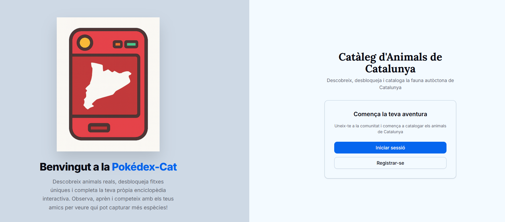
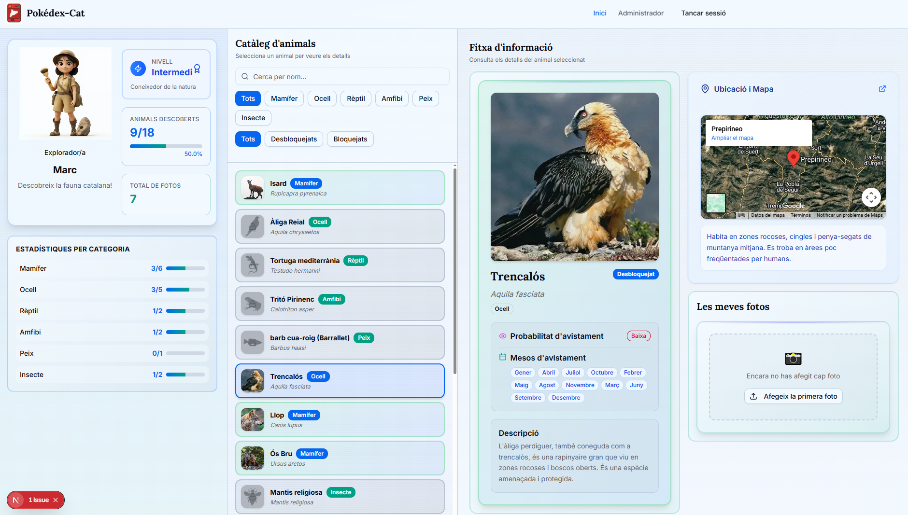
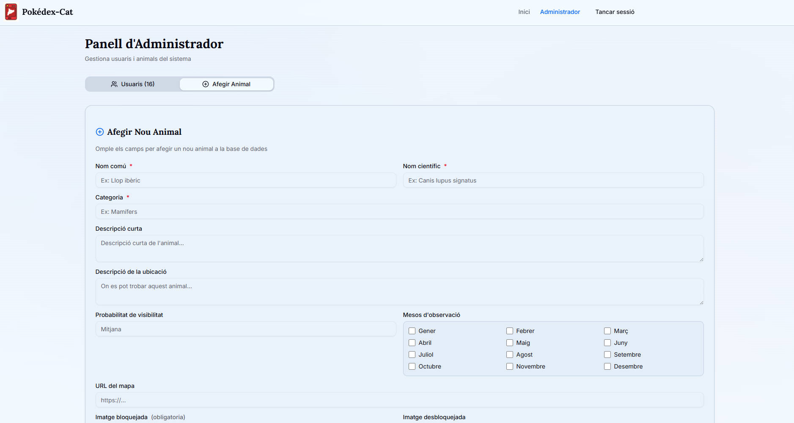

# 🦅 Pokédex Animals Catalunya - Backend API

**A gamified wildlife discovery platform for exploring Catalan fauna**

[](https://spring.io/projects/spring-boot)
[](https://www.oracle.com/java/)
[](https://mariadb.org/)
[](LICENSE)

[Features](#-features) • [Quick Start](#-quick-start) • [API Docs](#-api-documentation) • [Architecture](#-architecture) • [Frontend Repo](https://github.com/mxg952/pokedex-animals-catalunya-front.git)

---

## 📋 Table of Contents

- [About](#-about-the-project)
- [Features](#-features)
- [Tech Stack](#-tech-stack)
- [Quick Start](#-quick-start)
- [API Documentation](#-api-documentation)
- [Architecture](#-architecture)
- [Database Schema](#-database-schema)
- [Environment Variables](#-environment-variables)
- [Testing](#-testing)
- [Contributing](#-contributing)

---

## 🌟 About the Project

**Pokédex Animals Catalunya** is a full-stack application that gamifies wildlife discovery in Catalonia. Users can explore, photograph, and collect information about native Catalan animals, similar to the Pokémon GO concept but focused on real wildlife education.

This repository contains the **backend REST API** built with Spring Boot. The frontend application can be found here:
👉 **[Frontend Repository](https://github.com/mxg952/pokedex-animals-catalunya-front.git)**

### Key Concepts
📱 User Experience Flow:
1. Browse animals in catalog (locked/unlocked states)
2. Upload photos of animals in the wild
3. Unlock animals by submitting validated photos
4. Build personal wildlife collection
5. Track discovery progress

---

## ✨ Features

### 🔐 Authentication & Authorization
- JWT-based authentication with secure token management
- Role-based access control (USER & ADMIN)
- Password encryption with BCrypt
- Token expiration handling



### 🦊 Animal Management
- Complete CRUD operations for animal catalog
- Dual image system (locked/unlocked states)
- Rich animal data (scientific names, descriptions, locations)
- Admin-only animal creation

### 📸 Photo Upload & Validation
- Multi-photo upload per animal
- File validation and storage
- User photo galleries
- Image serving with secure URLs

### 👤 User Collection System
- Track unlocked animals per user
- Progress tracking
- Personal wildlife journal
- Photo management



### 📊 Admin Dashboard
- System statistics (users, animals, unlocks)
- User management
- Data analytics




---

## 🛠 Tech Stack

<table>
<tr>
<td valign="top" width="50%">

### Backend Core
- **Java 21** - Programming language
- **Spring Boot 3.5.7** - Framework
- **Spring Security** - Authentication/Authorization
- **Spring Data JPA** - Database ORM
- **Hibernate** - JPA implementation

</td>
<td valign="top" width="50%">

### Infrastructure
- **MariaDB 10.11** - Database
- **Docker & Docker Compose** - Containerization
- **Gradle 8.14.3** - Build tool
- **JWT** - Token management
- **SpringDoc OpenAPI** - API documentation

</td>
</tr>
</table>

---

## 🚀 Quick Start

### Prerequisites

```
☑️ Java 21 or higher
☑️ Docker & Docker Compose
☑️ Gradle (or use included wrapper)
```

### Installation

1️⃣ **Clone the repository**
```
git clone <backend-repository-url>
cd pokedex-backend
```

2️⃣ **Start the database**
```
docker-compose up -d
```

3️⃣ **Configure environment variables**

Edit `src/main/resources/application.properties`:

```properties
# Database
spring.datasource.url=jdbc:mariadb://localhost:3306/pokedex
spring.datasource.username=root
spring.datasource.password=root

# JWT Configuration
jwt.secret=your-secret-key-here
jwt.expiration=86400000

# File Upload
app.upload.dir=/path/to/uploads
app.base-url=http://localhost:8080
```

4️⃣ **Build and run the application**
```bash
./gradlew build
./gradlew bootRun
```

5️⃣ **Access the application**
- API: http://localhost:8080
- Swagger UI: http://localhost:8080/swagger-ui.html
- Database: localhost:3306 (root/root)

---

## 📚 API Documentation

### Authentication Endpoints
```
POST /api/auth/login     - User login
POST /api/auth/register  - User registration
POST /api/auth/refresh   - Refresh JWT token
```

### Animal Endpoints
```
GET    /api/animals              - List all animals
GET    /api/animals/{id}         - Get animal details
POST   /api/animals              - Create animal (ADMIN)
PUT    /api/animals/{id}         - Update animal (ADMIN)
DELETE /api/animals/{id}         - Delete animal (ADMIN)
GET    /api/animals/user/{userId}- Get user's unlocked animals
```

### Photo Endpoints
```
POST /api/photos/upload  - Upload animal photos
GET  /api/photos/user    - Get user's photos
GET  /api/photos/animal/{animalId} - Get photos for animal
```

### Admin Endpoints
```
GET /api/admin/stats     - System statistics
GET /api/admin/users     - User management
```

---

## 🏗 Architecture

### Project Structure
```
src/main/java/
├── config/          - Security & application configuration
├── controller/      - REST API endpoints
├── service/         - Business logic layer
├── repository/      - Data access layer
├── entity/          - JPA entities
├── dto/            - Data transfer objects
└── security/        - Authentication & authorization
```

### Key Components
- **JWT Authentication Filter** - Handles token validation
- **UserDetailsService** - Manages user authentication
- **FileStorageService** - Handles image uploads and serving
- **AnimalService** - Core business logic for animal management

---

## 🗃 Database Schema

### Core Tables
```sql
users (id, username, password, role, created_at)
animals (id, common_name, scientific_name, category, short_description, 
         location_description, visibility_probability, map_url,
         photo_lock_file_name, photo_unlock_file_name)
user_animals (user_id, animal_id, unlocked_at)  
photos (id, user_id, animal_id, file_name, uploaded_at)
```

### Relationships
- **Users** ↔ **Animals** (Many-to-Many via user_animals)
- **Users** ↔ **Photos** (One-to-Many)
- **Animals** ↔ **Photos** (One-to-Many)

---

## ⚙️ Environment Variables

### Required Configuration
```properties
# Database
spring.datasource.url=jdbc:mariadb://localhost:3306/pokedex
spring.datasource.username=root
spring.datasource.password=root

# JWT
jwt.secret=your-256-bit-secret-key
jwt.expiration=86400000

# File Storage
app.upload.dir=./uploads
app.base-url=http://localhost:8080

# CORS (for frontend integration)
app.cors.allowed-origins=http://localhost:3000
```

---

## 🧪 Testing

### Running Tests
```bash
# Unit tests
./gradlew test

# Integration tests  
./gradlew integrationTest

# Test coverage report
./gradlew jacocoTestReport
```

### Test Structure
- **Unit Tests** - Service layer and utilities
- **Integration Tests** - REST API endpoints
- **Security Tests** - Authentication & authorization

---

## 🤝 Contributing

We welcome contributions! Please follow these steps:

1. **Fork the repository**
2. **Create a feature branch**
   ```bash
   git checkout -b feature/amazing-feature
   ```
3. **Commit your changes**
   ```bash
   git commit -m 'Add amazing feature'
   ```
4. **Push to the branch**
   ```bash
   git push origin feature/amazing-feature
   ```
5. **Open a Pull Request**

### Development Guidelines
- Follow Java coding conventions
- Write tests for new functionality
- Update documentation accordingly
- Use meaningful commit messages

---

## 📄 License

This project is licensed under the **Educational License** - see the [LICENSE](LICENSE) file for details.

> **Note**: This project is developed for educational purposes as part of academic coursework. Commercial use requires permission.

---

## 🐛 Troubleshooting

### Common Issues

**Database Connection Issues:**
- Ensure Docker containers are running: `docker ps`
- Check database credentials in application.properties

**File Upload Problems:**
- Verify upload directory permissions
- Check `app.upload.dir` configuration

**JWT Authentication Failures:**
- Validate token expiration settings
- Check secret key configuration

**CORS Errors:**
- Confirm frontend URL in CORS configuration
- Check browser console for detailed errors

### Getting Help
- Check existing GitHub issues
- Review API documentation at `/swagger-ui.html`
- Validate environment configuration

---

## 🌟 Future Enhancements

### Planned Features
- 🎯 Machine learning photo validation
- 📱 Mobile app development
- 🗺 Interactive map integration
- 👥 Social features and sharing
- 🏆 Achievement system and badges

### Technical Improvements
- 🔍 Advanced search and filtering
- 📊 Enhanced analytics dashboard
- 🔄 Real-time notifications
- ☁️ Cloud storage integration

---

## 🙏 Acknowledgments

- Inspired by the Pokédex concept from Pokémon
- Built with modern web technologies
- Focused on Catalan fauna education and awareness
